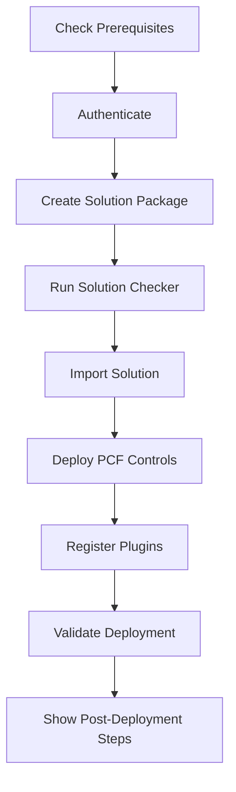

# Easy Spaces - CLI Deployment Quick Start Guide

## 🚀 Deploy in 3 Simple Steps

### Step 1: Install Prerequisites

**For Linux/WSL:**
```bash
./scripts/install-cli-tools.sh
```

**For Windows:**
```powershell
# Install .NET 8 SDK
winget install Microsoft.DotNet.SDK.8

# Install Node.js
winget install OpenJS.NodeJS

# Install Power Platform CLI
dotnet tool install --global Microsoft.PowerApps.CLI.Tool
```

### Step 2: Deploy the Solution

**Linux/WSL:**
```bash
./scripts/deploy-cli.sh --environment-url "https://yourorg.crm.dynamics.com"
```

**Windows PowerShell:**
```powershell
.\scripts\deploy-cli.ps1 -EnvironmentUrl "https://yourorg.crm.dynamics.com"
```

### Step 3: Verify Deployment
- Check your Dynamics 365 environment
- Import Power Automate flows manually
- Test the Easy Spaces application

## 📋 Command Options

### Basic Deployment
```bash
# Deploy everything
./scripts/deploy-cli.sh --environment-url "https://yourorg.crm.dynamics.com"
```

### Validation Only
```bash
# Run validation without deploying
./scripts/deploy-cli.sh --environment-url "https://yourorg.crm.dynamics.com" --validation-only
```

### Skip Components
```bash
# Skip PCF controls and plugins
./scripts/deploy-cli.sh --environment-url "https://yourorg.crm.dynamics.com" --skip-pcf --skip-plugins
```

### Custom Solution Name
```bash
# Use custom solution name and publisher prefix
./scripts/deploy-cli.sh --environment-url "https://yourorg.crm.dynamics.com" --solution-name "MyEasySpaces" --publisher-prefix "mes"
```

## 🔧 What Gets Deployed

### ✅ Solution Components
- **Entities**: Reservation, Space, Market
- **Relationships**: All entity relationships
- **Security Roles**: Easy Spaces user roles
- **Business Rules**: Validation logic

### ✅ PCF Controls
- **ReservationHelper**: Main reservation management control
- **CustomerDetails**: Customer information display
- **SpaceGallery**: Space image gallery
- **ReservationForm**: Reservation creation form

### ✅ Plugins
- **ReservationManagerPlugin**: Business logic and validation
- **Plugin Steps**: Registered for Create/Update operations
- **Custom Actions**: API endpoints for external integration

### ⚠️ Manual Steps Required
- **Power Automate Flows**: Import from `./power-automate/` folder
- **Sample Data**: Import from `./data/` folder (optional)
- **Security Configuration**: Assign users to roles

## 🛠️ Troubleshooting

### Common Issues

**Authentication Failed:**
```bash
# Clear existing auth and retry
pac auth clear
./scripts/deploy-cli.sh --environment-url "https://yourorg.crm.dynamics.com"
```

**PCF Control Build Failed:**
```bash
# Install Node.js and retry with PCF only
npm install -g npm@latest
./scripts/deploy-cli.sh --environment-url "https://yourorg.crm.dynamics.com" --skip-plugins
```

**Plugin Registration Failed:**
```bash
# Skip plugins initially, register manually later
./scripts/deploy-cli.sh --environment-url "https://yourorg.crm.dynamics.com" --skip-plugins
```

**Solution Import Error:**
```bash
# Run validation first to check for issues
./scripts/deploy-cli.sh --environment-url "https://yourorg.crm.dynamics.com" --validation-only
```

### Getting Help
```bash
# Show help for Linux script
./scripts/deploy-cli.sh --help

# Show help for PowerShell script
Get-Help .\scripts\deploy-cli.ps1 -Full
```

## 📊 Deployment Process Flow



## 🎯 Success Indicators

### ✅ Successful Deployment Shows:
- `Solution: ✅ Imported`
- `PCF Controls: ✅ Deployed` 
- `Plugins: ✅ Registered`
- `Validation: ✅ Completed`

### 🔍 Verification Steps:
1. **Solution exists** in Dynamics 365 Solutions area
2. **Entities visible** in Advanced Find
3. **PCF controls** appear in component library
4. **Plugins active** in Plugin Registration Tool view

## ⚡ Quick Commands Reference

| Task | Linux/WSL Command | Windows PowerShell |
|------|------------------|-------------------|
| **Full Deploy** | `./scripts/deploy-cli.sh --environment-url "URL"` | `.\scripts\deploy-cli.ps1 -EnvironmentUrl "URL"` |
| **Validate Only** | `./scripts/deploy-cli.sh --environment-url "URL" --validation-only` | `.\scripts\deploy-cli.ps1 -EnvironmentUrl "URL" -ValidationOnly` |
| **Skip PCF** | `./scripts/deploy-cli.sh --environment-url "URL" --skip-pcf` | `.\scripts\deploy-cli.ps1 -EnvironmentUrl "URL" -SkipPCF` |
| **Skip Plugins** | `./scripts/deploy-cli.sh --environment-url "URL" --skip-plugins` | `.\scripts\deploy-cli.ps1 -EnvironmentUrl "URL" -SkipPlugins` |

## 🔗 Related Documentation

- **[Complete Migration Guide](COMPLETE_MIGRATION_GUIDE.md)** - Full project overview
- **[GitHub Integration](GITHUB_INTEGRATION_GUIDE.md)** - Source control setup
- **[Deployment Guide 2024](DEPLOYMENT_GUIDE_2024.md)** - Advanced deployment options
- **[Code Review](CODE_REVIEW_AND_FIXES.md)** - Technical validation details

## 🎉 That's It!

Your Easy Spaces solution is now deployed and ready to use. The CLI deployment handles all the technical complexity while providing clear feedback on progress and any issues that need attention.

**Total deployment time: ~5-10 minutes** (depending on environment and components)